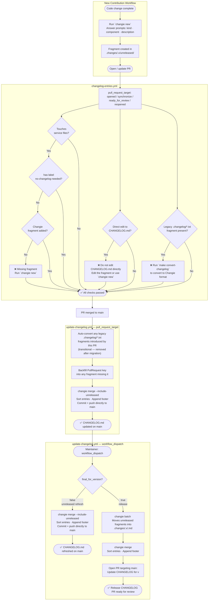

<!-- Copyright IBM Corp. 2014, 2026 -->
<!-- SPDX-License-Identifier: MPL-2.0 -->

# Changelog Process

HashiCorp's open-source projects maintain a user-friendly `CHANGELOG.md` that lets operators tell at a glance whether a release affects them and gauge the risk of an upgrade.

We use [Changie](https://changie.dev/) to generate the CHANGELOG from change fragment files stored in `.changes/<major_version_number>.x/unreleased/`. Every pull request that warrants a CHANGELOG entry must include a Changie fragment — CI will fail the pull request if one is missing.

## Installing Changie

Install Changie along with all other project tools:

```console
$ make tools
```

Or install it directly with Go:

```console
$ go install github.com/miniscruff/changie@latest
```

For other methods, see the [Changie installation documentation](https://changie.dev/guide/installation/).

## Creating a CHANGELOG Entry

Run the interactive tool from the repository root:

```console
$ changie new
```

Changie will prompt you for:

1. **Kind** — The type of change (Breaking Change, Note, Resource/Data Source/Ephemeral Resource/Function/List Resource/Action, Enhancement, or Bug)
2. **Impact** — The affected resource(s), data source(s), or other component(s)
3. **Body** — A description of the change
4. **Pull request number (if known)** — Optional. You may leave this blank; it is automatically backfilled into the fragment after the pull request is merged.

The tool creates a YAML fragment in `.changes/<major_version_number>.x/unreleased/` with a timestamped filename (e.g., `enhancement-20260120-143022.yaml`). Commit this file with your pull request.

!!! note
    Do not create fragment files by hand. Changie uses a specific file naming format required for correct CHANGELOG generation. Always use `changie new`.

### Example

Running `changie new` for an enhancement produces a fragment like this:

```yaml
kind: enhancement
body: Add `not_broken` attribute
custom:
  Impact: |-
    resource/aws_example_thing
```

Which generates this CHANGELOG entry:

```markdown
* resource/aws_example_thing: Add `not_broken` attribute ([#12345](https://github.com/hashicorp/terraform-provider-aws/issues/12345))
```

## Updating an Existing Entry

Edit the YAML file directly in `.changes/<major_version_number>.x/unreleased/`. Do not rename the file — the filename format is used by Changie during CHANGELOG generation.

!!! note
    If the change has already been released, edit the per-version CHANGELOG file (e.g., `.changes/6.x/6.1.0.md`) instead. Do not edit `CHANGELOG.md` directly — it is regenerated automatically on every PR merge and any manual edits will be overwritten.

Entries within each section (`BREAKING CHANGES`, `NOTES`, `FEATURES`, `ENHANCEMENTS`, `BUG FIXES`) are sorted alphabetically when the CHANGELOG is regenerated by GitHub Actions.

## What Requires a CHANGELOG Entry

### Changes That Should Have an Entry

- **New Resource/Data Source/Ephemeral Resource/List Resource/Function/Action** — Use the `feature` kind, select the appropriate option, and provide the resource name (e.g., `aws_secretsmanager_secret_policy`).
- **Bug Fix** — Use the `bug` kind. Set Impact to the affected resource, data source, or `provider`.
- **Enhancement** — Use the `enhancement` kind. Set Impact to the affected resource, data source, or `provider`.
- **Deprecation** — Use the `note` kind. Set Impact to the affected resource, data source, or `provider`.
- **Breaking Change** — Use the `breaking-change` kind. Set Impact to the affected resource, data source, or `provider`.
- **New AWS Region Support** — Use the `note` entry (Impact: `provider`) explaining the region and its opt-in requirements.

### Changes That May Have an Entry

- **Dependency updates** — Only when the update contains bug fixes or enhancements that directly affect operators.
- **Other notable changes** — Any operator-visible change not covered above. Use resource, data source, or `provider` prefixes in Impact where appropriate.

### Changes That Should Not Have an Entry

- Documentation updates
- Test updates
- Code refactoring with no user-visible effect

## Multi-Line Impact: Multiple CHANGELOG Entries from One Fragment

When a single change affects more than one resource or data source, enter each on its own line in the `Impact` prompt. Changie generates a separate CHANGELOG entry for each line, all sharing the same body text.

**Fragment:**

```yaml
kind: enhancement
body: Add configurable timeouts
custom:
  Impact: |-
    resource/aws_instance
    resource/aws_spot_instance_request
    data-source/aws_instance
```

**Generated CHANGELOG entries:**

```markdown
* resource/aws_instance: Add configurable timeouts ([#12345](https://github.com/hashicorp/terraform-provider-aws/issues/12345))
* resource/aws_spot_instance_request: Add configurable timeouts ([#12345](https://github.com/hashicorp/terraform-provider-aws/issues/12345))
* data-source/aws_instance: Add configurable timeouts ([#12345](https://github.com/hashicorp/terraform-provider-aws/issues/12345))
```

This works for all kinds that use an Impact field: `bug`, `enhancement`, `note`, and `breaking-change`.

## Migrating from `go-changelog`

**New pull requests** that include a `.changelog/*.txt` fragment from the previous `go-changelog` system will fail CI. Convert the fragment to Changie format before the pull request can merge:

```console
$ make convert-changelog FILE=.changelog/12345.txt
```

This parses your existing entry file, creates the equivalent Changie YAML fragment(s) in `.changes/<major_version_number>.x/unreleased/`, and deletes the original file.

**Existing pull requests** that were opened before this migration will not have received a CI failure about their `.changelog/` fragment. When such a pull request merges, CI automatically converts the fragment to Changie format — no manual action is required.

---

## Workflow Diagram

The diagram below illustrates the full CHANGELOG management workflow, from creating a fragment through to the generated `CHANGELOG.md` on `main`.


