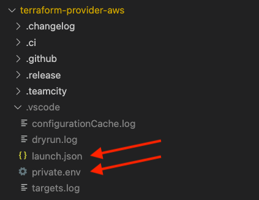
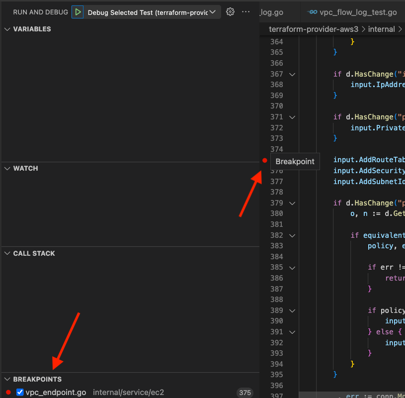
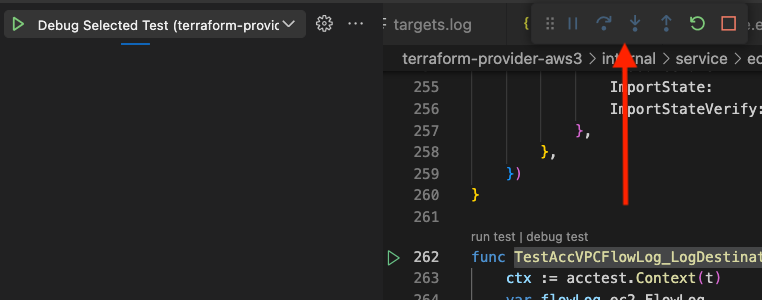

# Debugging

This guide covers strategies we have found useful in finding runtime and logic errors in the AWS Provider. We do not cover syntax or compiler errors as these are well addressed by [Go documentation](https://go.dev/ref/spec) and IDEs, such as Visual Studio Code ("VS Code").

If you have your own debugging tricks for the provider, open a pull request to add them here!

## 1. Reproduce

One of the most crucial steps in the process of bug fixing is to reproduce the bug and create a minimal reproduction of it. In this section, we will discuss why it is so important to reproduce bugs.

**TL;DR:** for Repro

Perhaps the most important step in debugging is reproducing the bug.

### What is a bug?

Before we dive into the details, let's first define what a bug is. A bug is an error or flaw that produces an incorrect or unexpected result, or causes the AWS Provider to behave in an unintended manner. For the Provider, "bugs" generally refer to errors that happen at runtime due to logic problems or unexpected interactions with AWS.

### Why is it important to reproduce bugs?

Reproducing a bug is the process of intentionally triggering the error or unexpected behavior that occurs when the bug is present. It is important to reproduce bugs because it allows us to:

1. **Verify that the bug exists**: By reproducing the bug, we can confirm that the error or unexpected behavior is real and either _always_ happens or happens _intermittently_ and not just a one-time occurrence. This is important because if we can't reproduce the bug, we may end up wasting time trying to fix a non-existent issue.
2. **Understand the cause of the bug**: Reproducing the bug can help us understand what is causing the error or unexpected behavior. This is important because without understanding the root cause of the bug, we may end up fixing _the symptoms_ of the bug rather than the underlying problem.
3. **Test the fix:** If we know how to reproduce the bug, we also know how to verify we've fixed it.

## 2. Create a _minimal_ reproduction

**TL;DR:** A complete 10-line configuration that reproduces a bug is _far more_ (perhaps 100× more) useful than a 1000-line configuration that reproduces the same bug.

Creating a minimal reproduction of a bug is the process of isolating the bug to its simplest form. It is _very important_ to create a minimal reproduction of bugs, especially with Terraform configurations, because it allows us to:

1. **Focus on the root cause of the bug**: By eliminating any extraneous configuration or dependencies, we can focus on the specific configuration that is causing the bug. This makes it easier to understand and fix the root cause of the bug.
2. **Save time**: By creating a minimal reproduction of the bug, we can reduce the amount of time it takes to reproduce the bug and test the fix. This is because we don't have to navigate through a large configuration or deal with unnecessary dependencies. _The minimal configuration becomes the basis of a [new acceptance test](#3-create-a-new-acceptance-test) that verifies the bug is fixed (and stays fixed in the future)._
3. **Make it easier for others to reproduce the bug**: If we are working on a team, creating a minimal reproduction of the bug makes it easier for other team members to reproduce the bug and understand the root cause.

### How to create a minimal reproduction of a bug

Creating a minimal reproduction of a bug can be a time-consuming process, but it is well worth the effort. Here are some tips for creating a minimal reproduction of a bug:

1. **Start with a simple test case**: Start with a simple configuration that causes the bug.
2. **Remove any extraneous configuration**: Remove as many resources, dependencies, and arguments as possible to simplify, while still maintaining [test independence](running-and-writing-acceptance-tests.md#test-configuration-independence).
3. **Verify that the configuration still reproduces the bug**: After removing the configuration, make sure that the configuration still causes the bug. If the bug no longer occurs, you may have removed too much. In this case, add back configuration until the bug reappears.

_A minimal configuration is worth its weight in gold._ If you're only able to make it this far in the debugging process, create a new issue with your minimal configuration or add it to an existing issue. A minimal configuration is a great way to give someone else a jump start in looking at the problem.

## 3. Create A New Acceptance Test

Sometimes, we tend to immediately jump into the code without creating a test. However, [creating an acceptance test](running-and-writing-acceptance-tests.md#writing-an-acceptance-test) is something we'll need to do eventually anyway but doing it _first_ has the added benefit of allowing us to easily trigger the bug. That makes debugging easier and allows us to use debugging tools.

### Use the Minimal Configuration as the Basis for the Test

Adding a problematic minimal configuration test is just like [creating an acceptance test](running-and-writing-acceptance-tests.md#writing-an-acceptance-test) except that when we run it, it has a problem. Starting with the end in mind focuses our efforts and gives great satisfaction when the code is fixed!

#### Erroring tests example

For example, if we're looking at an error in the VPC flow log resource, this is how we might add a test with a minimal configuration to trigger the error.

```go
func TestAccVPCFlowLog_destinationError(t *testing.T) {
	ctx := acctest.Context(t)
	rName := sdkacctest.RandomWithPrefix(acctest.ResourcePrefix)

	resource.ParallelTest(t, resource.TestCase{
		PreCheck:                 func() { acctest.PreCheck(ctx, t) },
		ErrorCheck:               acctest.ErrorCheck(t, names.EC2ServiceID),
		ProtoV5ProviderFactories: acctest.ProtoV5ProviderFactories,
		CheckDestroy:             testAccCheckFlowLogDestroy(ctx),
		Steps: []resource.TestStep{
			{
				Config:      testAccVPCFlowLogConfig_destinationError(rName),
			},
		},
	})
}

// ...

func testAccVPCFlowLogConfig_destinationError(rName string) string {
	return fmt.Sprintf(`
resource "aws_flow_log" "test" {
  # minimal configuration causing a bug
}
`, rName)
}
```

If we were to [run the test](running-and-writing-acceptance-tests.md#running-an-acceptance-test) on the command line, this is how the erroring output might look:

```console
make testacc TESTS=TestAccVPCFlowLog_destinationError PKG=vpc
```

```
==> Checking that code complies with gofmt requirements...
TF_ACC=1 go test ./internal/service/ec2/... -v -count 1 -parallel 20 -run='TestAccVPCFlowLog_destinationError'  -timeout 180m
=== RUN   TestAccVPCFlowLog_destinationError
=== PAUSE TestAccVPCFlowLog_destinationError
=== CONT  TestAccVPCFlowLog_destinationError
    vpc_flow_log_test.go:297: Step 1/1 error: Error running apply: exit status 1
        
        Error: creating Flow Log (vpc-0c2635533cef2be79): 1 error occurred:
        	* vpc-0c2635533cef2be79: 400: Access Denied for LogDestination: does-not-exist. Please check LogDestination permission

          with aws_flow_log.test,
          on terraform_plugin_test.tf line 34, in resource "aws_flow_log" "test":
          34: resource "aws_flow_log" "test" {
        
--- FAIL: TestAccVPCFlowLog_destinationError (13.79s)
FAIL
FAIL	github.com/hashicorp/terraform-provider-aws/internal/service/ec2	15.373s
FAIL
make: *** [testacc] Error 1
```

#### Wrong results example

Of course, not all bugs throw errors. For example, perhaps the bug you are looking at involves a wrong value in the `log_group_name` attribute. This is an example of adding a test that will error because the value is wrong.

```go
func TestAccVPCFlowLog_destinationError(t *testing.T) {
	ctx := acctest.Context(t)
	rName := sdkacctest.RandomWithPrefix(acctest.ResourcePrefix)

	resource.ParallelTest(t, resource.TestCase{
		PreCheck:                 func() { acctest.PreCheck(ctx, t) },
		ErrorCheck:               acctest.ErrorCheck(t, names.EC2ServiceID),
		ProtoV5ProviderFactories: acctest.ProtoV5ProviderFactories,
		CheckDestroy:             testAccCheckFlowLogDestroy(ctx),
		Steps: []resource.TestStep{
			{
				Config:      testAccVPCFlowLogConfig_destinationError(rName),
                Check: resource.ComposeTestCheckFunc(
					testAccCheckFlowLogExists(ctx, resourceName, &flowLog),
					resource.TestCheckResourceAttr(resourceName, "log_group_name", ""), // this should not be empty
				),
			},
		},
	})
}

// ...

func testAccVPCFlowLogConfig_destinationError(rName string) string {
	return fmt.Sprintf(`
resource "aws_flow_log" "test" {
  # minimal configuration causing a bug
}
`, rName)
}
```

If we were to [run the test](running-and-writing-acceptance-tests.md#running-an-acceptance-test) on the command line, this is how the erroring output might look:

```console
make testacc TESTS=TestAccVPCFlowLog_LogDestinationType_s3 PKG=vpc
```

```
==> Checking that code complies with gofmt requirements...
TF_ACC=1 go test ./internal/service/ec2/... -v -count 1 -parallel 20 -run='TestAccVPCFlowLog_LogDestinationType_s3'  -timeout 180m
=== RUN   TestAccVPCFlowLog_LogDestinationType_s3
=== PAUSE TestAccVPCFlowLog_LogDestinationType_s3
=== CONT  TestAccVPCFlowLog_LogDestinationType_s3
    vpc_flow_log_test.go:269: Step 1/2 error: Check failed: Check 3/4 error: aws_flow_log.test: Attribute 'log_group_name' expected "abc-123", got ""
--- FAIL: TestAccVPCFlowLog_LogDestinationType_s3 (15.49s)
FAIL
FAIL	github.com/hashicorp/terraform-provider-aws/internal/service/ec2	17.358s
FAIL
make: *** [testacc] Error 1
```

### Take Stock

It may seem like we haven't accomplished much of anything at this point. However, we have! We've:

1. Reproduced the error
2. Created a minimal reproduction
3. Created a test to trigger the error

This will make the rest of debugging a lot more straightforward.

### Contributing a Failing Test

If you aren't able to figure out a bug or delving into code is not your thing, open a pull request to [contribute just the test](running-and-writing-acceptance-tests.md#writing-an-acceptance-test) that highlights the bug. This is a valuable starting point for future work!

We ask that you make the test "PASS," but use code comments and a GitHub issue to explain what is wrong. With nearly 7,000 acceptance tests, there is always a certain percentage that inexplicably fails. Since we know that the new test we're adding highlights a known bug, we don't want the failure to be lost in the tally of inexplicable failures.

#### Failing Test Contribution Example: Errors

For example, if you want to contribute just a failing test, the example below shows how to use `ExpectError` and a code comment to reference an open GitHub issue addressing the bug. Here we're using `ExpectError` to allow the test to "pass," even though it should not. When the next person comes along to debug, they can simply remove `ExpectError`.

```go
func TestAccVPCFlowLog_destinationError(t *testing.T) {
	ctx := acctest.Context(t)
	rName := sdkacctest.RandomWithPrefix(acctest.ResourcePrefix)

	resource.ParallelTest(t, resource.TestCase{
		PreCheck:                 func() { acctest.PreCheck(ctx, t) },
		ErrorCheck:               acctest.ErrorCheck(t, names.EC2ServiceID),
		ProtoV5ProviderFactories: acctest.ProtoV5ProviderFactories,
		CheckDestroy:             testAccCheckFlowLogDestroy(ctx),
		Steps: []resource.TestStep{
			{
				Config:      testAccVPCFlowLogConfig_destinationError(rName),
                // This error should not happen!
                // See https://github.com/hashicorp/terraform-provider-aws/issues/45912
				ExpectError: regexache.MustCompile(`invalid destination`),
			},
		},
	})
}

// ...

func testAccVPCFlowLogConfig_destinationError(rName string) string {
	return fmt.Sprintf(`
resource "aws_flow_log" "test" {
  # minimal configuration causing a bug
}
`, rName)
}
```

#### Failing Test Contribution Example: Wrong Results

There are other types of bugs besides the error thrown in the previous example. For example, with a wrong results test, you would have `resource.TestCheckResourceAttr()` highlighting what is wrong, along with a link to the GitHub issue to explain why the attribute value is wrong.

```go
func TestAccVPCFlowLog_destinationError(t *testing.T) {
	ctx := acctest.Context(t)
	rName := sdkacctest.RandomWithPrefix(acctest.ResourcePrefix)

	resource.ParallelTest(t, resource.TestCase{
		PreCheck:                 func() { acctest.PreCheck(ctx, t) },
		ErrorCheck:               acctest.ErrorCheck(t, names.EC2ServiceID),
		ProtoV5ProviderFactories: acctest.ProtoV5ProviderFactories,
		CheckDestroy:             testAccCheckFlowLogDestroy(ctx),
		Steps: []resource.TestStep{
			{
				Config:      testAccVPCFlowLogConfig_destinationError(rName),
				Check: resource.ComposeTestCheckFunc(
					testAccCheckFlowLogExists(ctx, resourceName, &flowLog),
                     // log_group_name should be "xyz-123"
                     // See https://github.com/hashicorp/terraform-provider-aws/issues/45912
					resource.TestCheckResourceAttr(resourceName, "log_group_name", ""),
				),
			},
		},
	})
}

// ...

func testAccVPCFlowLogConfig_destinationError(rName string) string {
	return fmt.Sprintf(`
resource "aws_flow_log" "test" {
  # minimal configuration causing a bug
}
`, rName)
}
```

## 4. Find Out Why a Bug Happens

Now that we can easily reproduce a bug with a test and we have a minimal configuration, we can look more closely at why the bug is happening.

There are several approaches to looking at what is happening in the AWS provider. You might find that some bugs lend themselves to one approach while others are more easily evaluated with another. Also, you might start with one approach and then find you need to move to another, _e.g._, starting by adding a few `fmt.Printf()` statements and then move to an IDE debugger.

### Use `fmt.Printf()`

One quick and dirty approach that works for simple bugs is to have Go output information to the console (_i.e._, terminal). This approach is especially helpful if you've reviewed the code, found an error, and have a strong suspicion about what is going on. You can use `fmt.Printf()` to confirm what you think is happening.

The approach is also helpful to see if the code reaches a certain point or for seeing the value of a variable or two.

This approach does not work well for complex logic, examining many lines of code, or for looking at many different variables. Use more advanced debugging, as described below, for these situations.

This example shows using `fmt.Printf()` to output information to the console:

```go
func resourceLogFlowCreate(ctx context.Context, d *schema.ResourceData, meta interface{}) diag.Diagnostics {
    // other code ...

	outputRaw, err := tfresource.RetryWhenAWSErrMessageContains(ctx, propagationTimeout, func() (interface{}, error) {
		return conn.CreateFlowLogsWithContext(ctx, input)
	}, errCodeInvalidParameter, "Unable to assume given IAM role")

    fmt.Printf("reached point %d, with input: %+v\n", 3, input)

	if err == nil && outputRaw != nil {
        fmt.Printf("reached point %d, with output: %+v\n", 4, outputRaw)
		err = UnsuccessfulItemsError(outputRaw.(*ec2.CreateFlowLogsOutput).Unsuccessful)
	}

    // other code ...
}
```

[Running the test](running-and-writing-acceptance-tests.md#running-an-acceptance-test) from the command line, we might see the following output:

```console
make testacc TESTS=TestAccVPCFlowLog_LogDestinationType_s3 PKG=vpc
```

```
==> Checking that code complies with gofmt requirements...
TF_ACC=1 go test ./internal/service/ec2/... -v -count 1 -parallel 20 -run='TestAccVPCFlowLog_LogDestinationType_s3'  -timeout 180m
=== RUN   TestAccVPCFlowLog_LogDestinationType_s3
=== PAUSE TestAccVPCFlowLog_LogDestinationType_s3
=== CONT  TestAccVPCFlowLog_LogDestinationType_s3
reached point 3, with input: {
  ClientToken: "terraform-20230403170214312900000001",
  LogDestination: "arn:aws:s3:::tf-acc-test-4802362269206133111",
  LogDestinationType: "s3",
  MaxAggregationInterval: 600,
  ResourceIds: ["vpc-093265898e824c24e"],
  ResourceType: "VPC",
  TagSpecifications: [{
      ResourceType: "vpc-flow-log",
      Tags: [{
          Key: "Name",
          Value: "tf-acc-test-4802362269206133111"
        }]
    }],
  TrafficType: "ALL"
}
reached point 4, with output: {
  ClientToken: "terraform-20230403170214312900000001",
  FlowLogIds: ["fl-09861862b9f8bb3a3"]
}
--- PASS: TestAccVPCFlowLog_LogDestinationType_s3 (26.45s)
```

### Use Visual Studio Code Debugging

Using debugging from within VS Code provides extra benefits but also an extra challenge. The extra benefits include the ability to set breakpoints, step over and into code, and see the values of variables. The extra challenge is getting your debug environment properly set up to include access to your AWS credentials and environment variables used for testing.

Special thanks to Drew Mullen for [his work on debugging the AWS provider in VS Code](https://dev.to/drewmullen/vscode-terraform-provider-development-setup-debugging-6bn).

#### Set up `launch.json`

VS Code uses a hidden directory called `.vscode` in the root of your project for configuration files. This directory and the files it contains are ignored by Git using the `.gitignore` file included with the AWS provider. This allows you to have your own local configuration without concerns that it will be uploaded to or overwritten by the AWS provider repository.

As shown below, use VS Code to create two files in the `.vscode` directory: `launch.json` and `private.env`.



In `launch.json`, add this configuration:

```json
{
  "version": "0.2.0",
  "configurations": [
    {
      "name": "Debug Selected Test",
      "request": "launch",
      "type": "go",
      "args": [
        "-test.v",
        "-test.run",
        "^${selectedText}$"
      ],
      "mode": "auto",
      "program": "${fileDirname}",
      "env": {"PKG_NAME": "${relativeFileDirname}"},
      "envFile": "${workspaceFolder}/.vscode/private.env",
      "showLog": true
    }
  ]
}
```

In `private.env`, add environment variables to represent your AWS provider testing configuration, including replacing `aws_provider_profile` and `aws_alternate_profile` below with the names of profiles defined in your `~/.aws/config` file:

```env
TF_ACC=1
TF_LOG=info
GOFLAGS='-mod=readonly'
AWS_PROFILE=aws_provider_profile
AWS_DEFAULT_REGION=us-west-2
AWS_ALTERNATE_PROFILE=aws_alternate_profile
AWS_ALTERNATE_REGION=us-east-1
AWS_THIRD_REGION=us-east-2
ACM_CERTIFICATE_ROOT_DOMAIN=terraform-provider-aws-acctest-acm.com
```

Note that you _can_ set `TF_LOG` to `debug` but, if you do, you can receive thousands of lines of additional information that can make it difficult to find useful information.

#### Viewing Run and Debug

Open the Run and Debug panel in VS Code by pressing `Shift-⌘-D` or by clicking on the debug button icon:


To debug, you'll also want to open the debug console by pressing `Shift-⌘-Y` or selecting "Debug Console" from the View top menu.

#### Run and Debug

With the environment and VS Code GUI set up, you are ready to run and debug.

1. As shown below, select the name of a test function from a `*_test.go` file by double-clicking on the name or click-dragging over the name to highlight the entire name. (Do not include the `func` at the beginning or `(t *testing.T) {` at the end.)
2. Make sure that "Debug Selected Test" is shown next to the debug play button.
3. Click on the play button in the Run and Debug panel. Depending on your configuration, there may also be a "Debug Selected Test" option at the bottom of the VS Code window. Clicking on that is equivalent to clicking the play button in the Run and Debug panel.


#### Breakpoints

Depending on where you suspect the problems are occurring, you can set breakpoints on the resource's Create, Read, Update, Delete, or other functions. The debugger will stop at the first breakpoint it encounters.

Setting breakpoints is built into VS Code and is easy. Hover to the left of a line number and you'll see a faded red dot. Click on the faded red dot to turn it into a breakpoint, as shown below.

You can see a list of breakpoints throughout the codebase at the bottom of the Run and Debug panel, as shown below.



#### Stepping Out

Once the debugger has stopped at a breakpoint, you can control how it continues from there. VS Code will display the debugger controls, which you can reposition using the grip (_i.e._, six dots), at the left of the controls.



From left to right, the controls are as follows:

1. Pause (_i.e._, two vertical lines) pauses execution wherever it happens to be when you click pause
2. Step over (_i.e._, dot with a curved arrow above it) goes to the next statement but will not follow execution inside functions
3. Step into (_i.e._, dot with an arrow pointing down) goes to the next statement, following execution inside functions
4. Step out (_i.e._, dot with an arrow pointing up) goes to the next statement in the calling function skipping the rest of the execution in the current function
5. Restart (_i.e._, the circular arrow) stops the current run and starts at the beginning again
6. Stop (_i.e._, the square) stops the current run

### Use Delve

Behind the scenes, VS Code and other IDEs use Delve to debug. You can also use Delve without an IDE if you prefer to work on the command line.

Here are some resources to get you started using Delve:

* [Delve on GitHub](https://github.com/go-delve/delve)
* [Golang Debugging With Delve (Step-by-Step)](https://golang.cafe/blog/golang-debugging-with-delve.html)
* [Using the Go Delve Debugger from the command line](https://www.jamessturtevant.com/posts/Using-the-Go-Delve-Debugger-from-the-command-line/)
* [Stop debugging Go with Println and use Delve instead](https://opensource.com/article/20/6/debug-go-delve)

## 5. Verify the Fix with a Test

Verify that bugs are fixed with one or more tests. The tests used to help debug, described above, verify that the bug is fixed after debugging. In addition, the tests ensure that future changes don't undo the fix.
